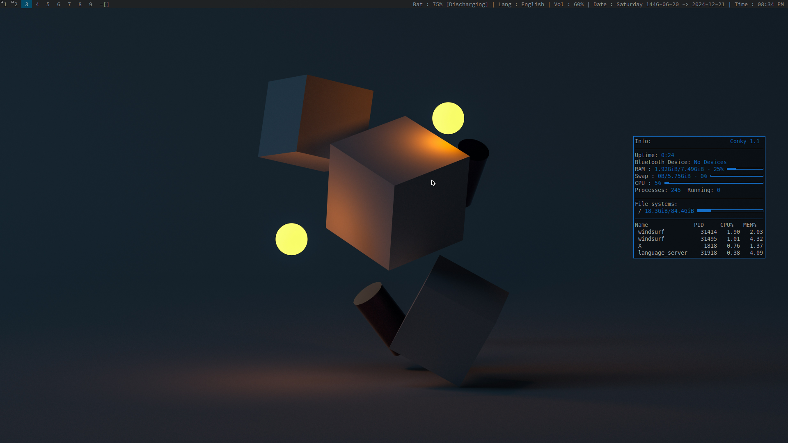
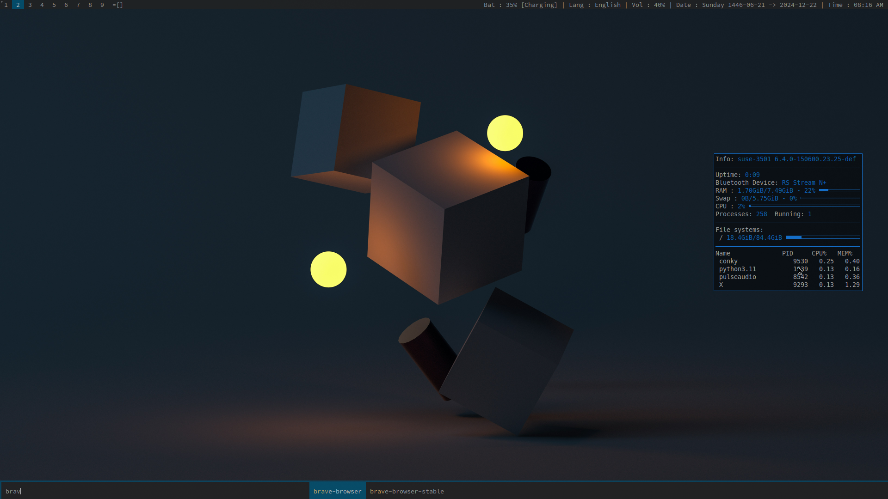

# Suckless Tools Configuration

This repository contains my configuration for suckless tools (dwm, st, dmenu, etc.), along with some helpful scripts.

## Info From My System 
```
----------------------------------------------------------------------
                 `-++:`                                      
               ./oooooo/-                  ------------------
            `:oooooooooooo:.               OS: openSUSE Leap 15.6 x86_64
          -+oooooooooooooooo+-`            Host: Inspiron 3501
       ./oooooooooooooooooooooo/-          Kernel: 6.4.0-150600.23.25-default
      :oooooooooooooooooooooooooo:                        
    `  `-+oooooooooooooooooooo/-   `                                         
 `:oo/-   .:ooooooooooooooo+:`  `-+oo/.    Shell: bash 4.4.23
`/oooooo:.   -/oooooooooo/.   ./oooooo/.   Resolution: 1920x1080
  `:+ooooo+-`  `:+oooo+-   `:oooooo+:`     WM: dwm
     .:oooooo/.   .::`   -+oooooo/.        Theme: Breeze [GTK2/3]
        -/oooooo:.    ./oooooo+-           Icons: breeze-dark [GTK2/3]
          `:+ooooo+-:+oooooo:`             Terminal: alacritty
             ./oooooooooo/.                CPU: 11th Gen Intel i5-1135G7 (8) @ 4.200GHz
                -/oooo+:`                  GPU: Intel TigerLake-LP GT2 [Iris Xe Graphics]
                  `:/.                     Memory: 593MiB / 7671MiB
				                           ------------------
----------------------------------------------------------------------
```
## ScreenShots



## Installation Guide

### 1. Install Build Dependencies

#### Debian/Ubuntu
```bash
sudo apt update
sudo apt install build-essential libx11-dev libxft-dev libxinerama-dev libfreetype6-dev \
    libfontconfig1-dev libxcb1-dev libxrandr-dev libimlib2-dev libfribidi-dev \
    libxrender-dev libxext-dev x11proto-dev pkg-config
```

#### Arch Linux
```bash
sudo pacman -Syu
sudo pacman -S base-devel libx11 libxft libxinerama freetype2 fontconfig \
    libxcb libxrandr imlib2 fribidi libxrender libxext
```

#### Fedora
```bash
sudo dnf groupinstall "Development Tools"
sudo dnf install libX11-devel libXft-devel libXinerama-devel freetype-devel \
    fontconfig-devel libxcb-devel libXrandr-devel imlib2-devel fribidi-devel \
    libXrender-devel libXext-devel
```

#### openSUSE
```bash
sudo zypper install -t pattern devel_basis
sudo zypper install libX11-devel libXft-devel libXinerama-devel freetype-devel \
    fontconfig-devel libxcb-devel libXrandr-devel imlib2-devel fribidi-devel \
    libXrender-devel libXext-devel
```

### 2. Install Required Programs
These programs are used by the window manager and scripts:

#### Debian/Ubuntu
```bash
sudo apt install nitrogen conky sxhkd xscreensaver syncthing python3 python3-pip compton
```

#### Arch Linux
```bash
sudo pacman -S nitrogen conky sxhkd xscreensaver syncthing python python-pip picom
```

#### Fedora
```bash
sudo dnf install nitrogen conky sxhkd xscreensaver syncthing python3 python3-pip picom
```

#### openSUSE
```bash
sudo zypper install nitrogen conky sxhkd xscreensaver syncthing python3 python3-pip picom
```

### 3. Install Python Dependencies
```bash
python3 -m venv scripts/statusbar/pythonvenv
source scripts/statusbar/pythonvenv/bin/activate
pip install psutil # Add other required Python packages here
```

### 4. Clone and Build
```bash
# Clone the repository
git clone https://github.com/KhaledMahfouz5/sucklessToolsConfig.git
cd sucklessToolsConfig

# Build dwm
cd dwm-6.5
sudo make clean install
cd ..

# Build st (terminal)
cd st-0.9.2
sudo make clean install
cd ..

# Build dmenu
cd dmenu-5.3
sudo make clean install
cd ..
```

2. Set up autostart:
   - The window manager will automatically start the required services as configured in `dwm-6.5/config.def.h`
   - Make sure all scripts are executable:
```bash
chmod +x scripts/*.sh
chmod +x scripts/**/*.sh
```

### 6. Start DWM
Add the following to your `~/.xinitrc`:
```bash
exec dwm
```

Then start X server:
```bash
startx
```

## Fix rendering Emojis Issue 
- you don't need to modify dwm source code 
- you should use the patched version of libXft and you should have installed the xorg-macros package 
- you have to install an emoji font like **Noto Color Emoji** font , you can download it from google fonts .
- you can install libXft-bgra and xorg-macros from your package manager or you can build the both manually .
---
1- patched libXft :
```bash
git clone https://github.com/uditkarode/libxft-bgra
cd libxft-bgra
sh autogen.sh --sysconfdir=/etc --prefix=/usr --mandir=/usr/share/man
sudo make install
```
2- xorg-macros :
```bash
wget http://ftp.x.org/pub/individual/util/util-macros-1.19.3.tar.gz
tar -xzvf util-macros-1.19.3.tar.gz
cd util-macros-1.19.3
./configure
sudo make install
```
---
- see `https://www.youtube.com/watch?v=IcQslz5Pb5Y` .

## Usage

- Alt + Shift: Toggle between keyboard layouts (US/Arabic)
- Check `sxhkd/sxhkdrc` for keyboard shortcuts
- The status bar shows system information using Python scripts
- Color temperature adjusts automatically based on time of day

## Note

- The `scripts/statusbar/pythonvenv` directory is ignored as it can be generated with:
```bash
python3 -m venv scripts/statusbar/pythonvenv
```
- The wallpaper sebastian.png is used as the default wallpaper, you can change it from nitrogen .

## Contributing

If you would like to contribute to this project, please fork the repository and submit a pull request with your changes.

## License

This project is licensed under the MIT License. See the LICENSE file for details.

## Contact

For any questions or support, please reach out to [Your Name] at [your-email@example.com].
